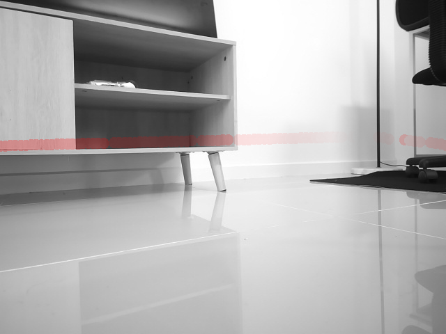

# Depth Map Overlay

## Objective

Overlay a graphical representation of distance readings from a 2D LiDAR scanner onto a POV image taken of a mobile robot's FOV.



## Install
```
pipenv install --dev
```

## Usage
### Inputs (input/)
- An image of the required scene in your preferred format matching the configured resolution below.
- A Python dictionary of raw LiDAR distance measurements.

### Outputs (output/)
- combined.jpg - Contains a grayscale version of the scene image with the relative distance measurements overlayed as red dots. The more solid a red dot is the closer that point is to the camera.
- points_only.jpg - Contains only the red dot points used in the combined image.

### Capture image from webcam (optional)
```
pipenv run python tools/capture_scene_image.py --camera_source 0 --filename input/scene.jpg
```
### Generate composite image
```
pipenv run python generate.py --image input/scene.jpg --data input/data.py
```

## Components
- 2D RPLiDAR scanner (RPLiDAR C1)
- Generic USB webcam (Hikvision DS-U02)

## Configuration Settings
Adjust in ```generate.py```.
- CAMERA_HORIZONTAL_FOV_DEGREES = 86
- CAMERA_VERTICAL_FOV_DEGREES = 55
- CAMERA_HORIZONTAL_RESOLUTION_PX = 640
- CAMERA_VERTICAL_RESOLUTION_PX = 480
- CAMERA_VERTICAL_CENTREPOINT_IN_FRAME_MM = 130
- LIDAR_VERTICAL_OFFSET_MM = 45
- LIDAR_DISTANCE_OFFSET_MM = -120
- CAMERA_FOCAL_LENGTH_MM = 3.6

## Limitations
- The format and parsing of the LiDAR data file is not ideal (working with data generated for another project).

## Changelog
#### 22 October 2024
- Correct interpolation to the vanishing point.
- Change dot colour to red.
#### 21 October 2024
- CAMERA_FOCAL_LENGTH_MM setting is now required (changed from reserved).
- Depth map overlay is more tightly fitting the scene. No longer just a straight line across the scene (using the camera's focal length to approximate the vanishing point).
